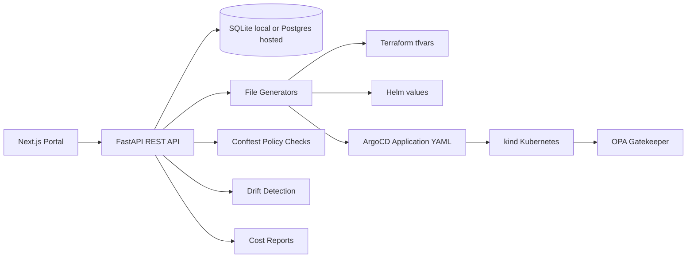
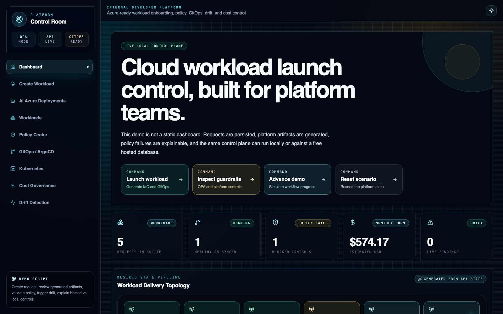
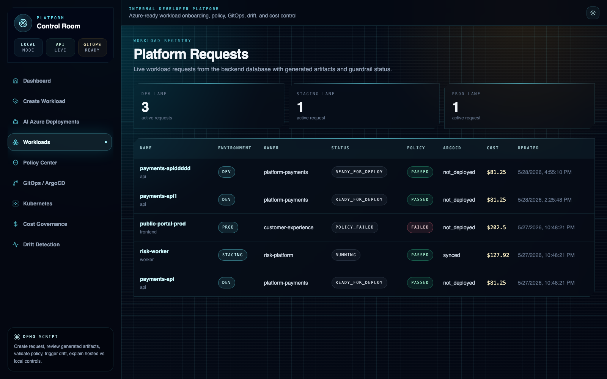
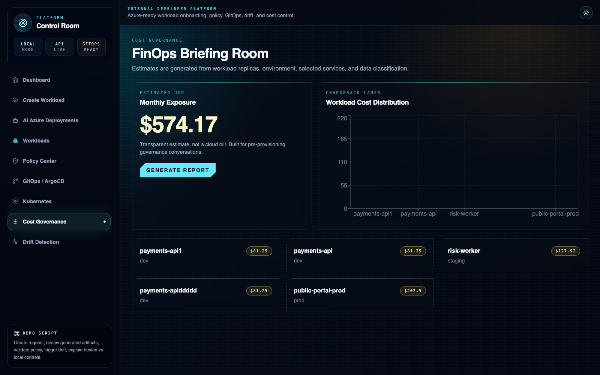

# Platform Control Room — Self-Service Cloud Platform Engineering Portal

[](https://github.com/ryana79/platform-control-room/actions/workflows/backend-ci.yml)
[](https://github.com/ryana79/platform-control-room/actions/workflows/frontend-ci.yml)
[](https://github.com/ryana79/platform-control-room/actions/workflows/policy-check.yml)
[](https://platformcontrolroom.com)

Platform Control Room is a Mission Control-style self-service platform engineering portal for onboarding workloads into an Azure-ready cloud platform. It implements practical platform engineering workflows end to end: workload intake, policy validation, GitOps delivery, drift visibility, and cost governance.

The default demo is free: no Azure subscription, no Azure credentials, and no paid resources are required.

Live demo:

- Primary domain: `https://platformcontrolroom.com`
- Vercel fallback: `https://frontend-mu-red-aue4awuyha.vercel.app`
- API health: `https://backend-five-roan-90.vercel.app/health`

## Why This Project Exists

Platform teams need repeatable workload onboarding, policy guardrails, GitOps delivery, drift visibility, and cost governance. Platform Control Room demonstrates those workflows end to end using a real backend, database-backed state, generated files, local Kubernetes, ArgoCD, Gatekeeper, and Conftest.

## Engineering Highlights

- Full-stack platform portal with Next.js, TypeScript, FastAPI, SQLAlchemy, SQLite/Postgres, Docker, Vercel, and Neon.
- 25 REST API routes for workload onboarding, artifact generation, policy checks, GitOps status, drift detection, activity, and cost reporting.
- Generates Terraform tfvars, Helm values, Kubernetes manifests, and ArgoCD Application YAML from each workload request.
- 7 GitHub Actions workflows covering backend tests, frontend lint/build, Terraform validation, Conftest policy checks, cost reports, drift checks, and the Azure connector plan.
- Hosted public demo backed by Postgres plus a richer local Docker/kind/ArgoCD/Gatekeeper workflow.
- Azure connector lite validates Entra ID/GitHub OIDC, Azure Storage Terraform state, Resource Graph reads, Cost Management reads, and Terraform plan without running AKS.
- AI GitLab deployment generator uses a Groq/OpenAI-compatible intake flow to produce Terraform and GitLab CI pipelines for Azure Resource Group, Storage Account, and Linux VM requests.

## Architecture



## Screenshots

The Mission Control dashboard, with workload launch control and live platform stats:



Platform Requests: onboarded workloads with generated artifacts, policy pass/fail status, environment, and cost:



The FinOps Briefing Room, showing monthly cost exposure and per-workload cost distribution:



## Tech Stack

- Frontend: Next.js App Router, TypeScript, Tailwind CSS, shadcn-style components, lucide-react, Recharts
- Backend: FastAPI, SQLite/Postgres, SQLAlchemy, Pydantic
- Local infrastructure: Docker Compose, kind, ArgoCD, OPA Gatekeeper, Conftest
- Infrastructure as Code: Azure-ready Terraform modules and dev/prod environments
- Delivery: GitOps manifests, ArgoCD Application generation, GitHub Actions, GitLab CI generation, Vercel
- AI/automation: Groq/OpenAI-compatible API, GitLab repository API, Azure CLI/OIDC connector

## Free Local Demo Setup

```bash
cp .env.example .env
docker compose up --build
```

If Docker is not installed, run the app natively in two terminals:

```bash
cd backend
python3 -m venv .venv
source .venv/bin/activate
pip install -r requirements.txt
uvicorn app.main:app --reload --port 8000
```

```bash
cd frontend
npm install
npm run dev
```

In another terminal, optional local cluster demo:

```bash
./scripts/create-kind-cluster.sh
./scripts/install-argocd.sh
./scripts/install-gatekeeper.sh
```

Open `http://localhost:3000`.

## Public Deployment

The project is deployed publicly while preserving the richer local infrastructure demo:

- Frontend: Vercel free tier
- Backend: FastAPI on Vercel Python serverless functions
- Database: Neon free Postgres
- Domain: `platformcontrolroom.com`
- Local-only controls: kind, ArgoCD, Gatekeeper, and live kubectl drift checks

Hosted visitors can create workloads, persist them in Postgres, view generated artifacts, run policy checks, trigger demo state changes, and generate cost reports. Local-only pages use a Hosted Demo Mode message when cluster tooling such as `kubectl`, kind, ArgoCD, or Gatekeeper is unavailable.

See `docs/free-public-deployment.md`.

## Azure Connector Lite

The project includes a safe Azure connector that proves the missing live-cloud layer without running AKS or paid compute. It creates an Entra ID app registration, GitHub OIDC federated credential, a low-cost Azure Storage backend for Terraform state, and a manual GitHub Actions workflow that runs a real Terraform plan against Azure.

See `docs/azure-connector-lite.md`.

## AI GitLab Deployment Generator

The `AI Azure Deployments` page lets a user choose what they want deployed, answer follow-up questions, generate Terraform plus `.gitlab-ci.yml`, and push the generated pipeline to a dedicated GitLab deployment repository when `GITLAB_TOKEN` and `GITLAB_PROJECT_ID` are configured.

See `docs/ai-gitlab-deployments.md`.

## Local Demo Flow

1. Create a workload request in the portal.
2. Confirm the backend saved it to SQLite.
3. Review generated Terraform tfvars, Helm values, ArgoCD Application YAML, and Kubernetes manifests.
4. Run policy validation and compare good vs bad workloads.
5. Deploy the sample workload to kind.
6. View local ArgoCD and Kubernetes status.
7. Trigger demo drift and run drift detection.
8. Generate a markdown cost governance report.

## Demo Walkthrough

1. Open Mission Control and explain the topology: portal, API, database, policy, GitOps, cluster, cost.
2. Click `Advance demo` to show activity changing from backend state.
3. Open `Workloads`, select `public-portal-prod`, and explain why public access in prod fails policy.
4. Open generated artifacts and show Terraform tfvars, Helm values, ArgoCD YAML, and Kubernetes manifests.
5. Open `Cost Governance` and generate the markdown report.
6. Explain the split: hosted demo proves the product works publicly; local kind/ArgoCD/Gatekeeper proves the infrastructure engineering depth.

## Optional Azure Deployment Warning

Azure deployment is optional and not required for the default demo. The Terraform modules are Azure-ready, but real `terraform apply` requires your own Azure subscription, credentials, backend state design, security review, and cost approval.

## How Workload Onboarding Works

The frontend sends workload configuration to FastAPI. The backend stores the request in SQLite locally or Postgres publicly, generates platform files, validates policy, calculates costs, records activity, and returns generated content to the UI.

## Policy-As-Code

Conftest checks generated manifests and Terraform-like inputs before deployment. Gatekeeper policies can be installed into the local kind cluster to enforce Kubernetes admission controls.

## GitOps

Platform Control Room generates ArgoCD Application YAML and desired Kubernetes manifests under `gitops/`. ArgoCD can sync those manifests into the local kind cluster.

## Drift Detection

The drift detector compares desired manifests against live `kubectl` output and reports missing deployments, manual replica changes, changed image tags, and missing labels.

## Cost Governance

Cost estimates are calculated from real workload configuration: replicas, environment, public access, selected services, and data classification. Reports are written to `reports/`.

## Security Design Decisions

- No hardcoded secrets
- No real subscription IDs
- `.env.example` only
- Local SQLite by default
- Public access is policy checked
- Owner, environment, and cost-center labels are mandatory
- Sensitive data classifications recommend Key Vault

