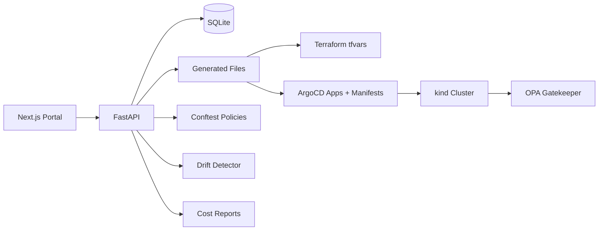

# Architecture

AzurePlatform uses a Next.js portal, FastAPI API, SQLite source of truth, generated Terraform/Helm/ArgoCD files, local kind Kubernetes, ArgoCD, Gatekeeper, Conftest, drift detection, and cost reports.

